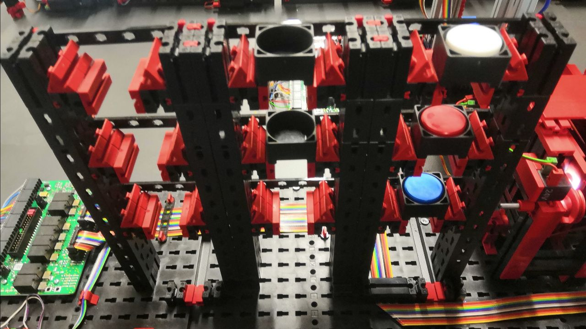

# How to Run the Factory

* Turn on Power
* Check that all 3 Controller (those with lan ports) are connected to the router
* Start warehouse config is:

* send configs to the factory (for example with mqtt_publish
  * set the desired factory side
  * start factory

## MQTT_Publish

Simple Commandline program to send configs to the factory

Download and run

* Clone [MQTT](https://github.tik.uni-stuttgart.de/IAS-MiniFactory/MQTT)
* run `mqtt_publish.py`

HOW TO

* After starting a menu will be displayed. Navigate by tipping in the character and pressing Enter.

OPTIONS:

* s: start factory (sends line_configs, wh_configs and start command)
* r: restart factory after PROBLEM occurred (sends a start command)
* x: stops the factory (Factory will be stopped, no restart possible (after a few seconds the factory will be running again))
* p: pauses the factory (Factory will be halted at next possible time (can take a few seconds))
* c: change config to be send
  * i: set factory to initial state.
  * 1: one line from Start to end. (specified in `line_configs1`)
  * 2: four lines with different paths. (specified in `line_configs14`)
  * 3: Runs a loop indefinitely
* f: change Factory side
  * r: change to Right side
  * l: change to Left side
* g: show getter functions (a receiver is required for example MQTT_Receive))
  * c: get Line config (get all the configs currently set in the factory)
  * l: get Line status (get status of all active lines)
  * w: get Warehouse content
  * m: get Machine status (get status of all Machines))
  * f: get Factory commands
* e: exit the publish program

## MQTT_Receive

Simple Commandline program to receive mqtt signals

Download and run

* Clone [MQTT](https://github.tik.uni-stuttgart.de/IAS-MiniFactory/MQTT)
* run `mqtt_receive.py`

In the file you can change some options

* line 18-20 chose to receive signals from the Right, Left or from Both ("+") factories)
* uncomment line 72 to revive all signals published to the mqtt_broker
